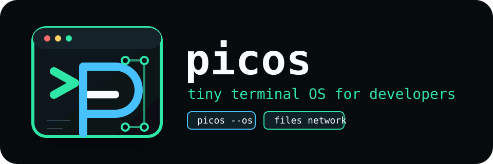

<p align="center">
  
</p>

# picos

A tiny terminal OS for developers.

`picos` is a lightweight cross-platform TUI/CLI for inspecting, diagnosing, and eventually controlling your local developer environment. It aims to feel closer to `lazygit`, `btop`, `k9s`, or a focused `lazyifconfig` than a plain command collection.

## Status

`picos` is early and unreleased. The current milestone focuses on a full-screen keyboard-driven console, read-only network diagnostics, and a locked action model for future privileged OS controls.

## Install

```bash
npm install -g @uulab/picos
```

The package is not published yet. For local development:

```bash
bun install
bun src/bin/picos.ts
```

## TUI Usage

```bash
picos
picos ui
```

Keyboard controls:

- `1-9`: select Dashboard, Files, Remotes, Editor, System, Hardware, Storage, Processes, or Interfaces
- `left/right` or `h/l`: move between workspaces
- `up/down` or `j/k`: move through workspaces, or actions inside Action Center
- `enter`: enter the focused workspace mode, run the selected action, open a directory, or preview a file
- `?` or `/`: open the command palette, then type to filter commands, including `trail` for recovered Timeline Evidence trail select/open/search actions
- Action Center: `enter` on locked write/admin/destructive actions opens a dry-run control preview with risk, privilege, confirmation phrase, lock reason, adapter-owned OS command preview when available, and an audit/timeline event; after `picos.update`, the locked `picos.update.apply` action opens the npm `--dry-run` update preview; the panel always shows the current execution policy, also shows a blocked policy simulation, after a preview `c` opens a typed confirmation prompt, and `x` attempts an opt-in dry-run execution through the configured policy
- Files workspace: `enter` opens file focus, `j/k` selects entries, `enter` opens, `..` appears as a parent entry, `f` filters by name/path/type, `enter` applies the filter, `esc` clears it, `c`/`m`/`x` open locked copy/move/delete previews, `b` returns to the previous file location, `1-9` jumps system locations, `:` opens path input with `.`/`..` support, `g` cycles system locations, `u` goes to the parent directory, and `h`/`esc` returns to workspace navigation
- Interfaces workspace: `j/k` selects interfaces and `Tab` cycles list/detail/stats/platform source panes
- Routes workspace: `f` filters route rows, `F` clears the filter, `P` saves the active filter, `]` cycles saved filters, `D` opens an exact `clear routes` confirmation for clearing saved route filter presets, `c` opens a locked clipboard preview for the active table/raw/diagnostics/path view, `Tab` cycles table/raw/diagnostics/path panes, `s` cycles route row sorting, and `:` opens destination path lookup
- Connections and Ports workspaces: show parsed rows plus clipped raw OS command output; `j/k` selects endpoints, `f` filters, `F` clears, `P` saves the active filter, `]` cycles filter presets, `D` opens an exact `clear connections` or `clear ports` confirmation for clearing saved endpoint filter presets, `Tab` cycles detail/raw/process panes, `enter` opens the selected PID in Processes, `s` cycles endpoint sorting, PID matches show process snapshots, `c` opens a locked clipboard preview, and Ports `K` opens a locked process termination preview for the selected listening PID
- Processes workspace: endpoint handoffs show PID detail plus labeled cwd/open-file/resource rows; `j/k` selects an item, `enter` opens local filesystem paths in Files or Editor, socket/pipe/unix resources are logged for inspection, and `c` opens a locked clipboard preview
- Logs workspace: `e` cycles severity, `f` searches, `F` clears, `P` saves search text to config, `]` cycles search presets, `S` saves the current severity/search profile to config, `}` cycles profiles, `D` opens an exact `clear logs` confirmation for clearing saved search presets and profiles, `L` toggles live follow refresh while viewing Logs, `C` clears follow counters/history, and `r` refreshes logs only
- Tools workspace: `n`/`N` cycles OS-aware and saved target presets forward/back, `T` saves the active target preset to config, `U` pins the selected saved target preset to the top, `L` renames the selected saved target preset, `M` edits the selected saved target value, `A` changes the selected saved target action, `X` deletes the selected saved target preset, `D` opens an exact `delete <action id>` confirmation for removing all saved target presets with the selected saved action, `C` opens an exact `clear tools history` confirmation for clearing saved history filter presets, `R` runs the selected preset, `j/k` selects previous runs, `Tab` cycles raw/summary/command detail panes, `f` filters history, `P` saves the active filter to config, `]` cycles saved presets, `s` cycles sorting, `G` groups by tool/action or status, `r` reruns, `y` copies summaries, `V` toggles TCP copy section between Target and Status, `,`/`.` moves the TCP row cursor inside that section, raw detail marks the selected TCP row with `>`, `copy help`, `copy hint`, `copy mode`, `copy section`, and `copy target` rows preview available/active raw/section/row copy flows with long values truncated on taller terminals, locked clipboard confirmations echo the selected copy path/tool/action and clip long payload previews to the terminal, `b` copies the selected TCP row, `v` copies the selected TCP section when present, `c` copies raw output, and `e`/`E` exports selected/all runs
- Timeline workspace: `t` cycles event kinds, `j/k` moves the visible row cursor through filtered/search-matched events, `c` opens a locked copy preview for the selected event, `e` exports the selected event to a single audit file, `E` returns selected Status Evidence focus audit rows to the matching Status Evidence controls, previews the Status `W` open, `Z` archive, and `enter` shortcuts, records the handoff in Status Activity result history for later copy/export, and persists a selected audit export for recovery after refresh or restart, `f` searches, `F` clears search, `P` saves search, `]` cycles presets, `D` opens an exact `clear timeline` confirmation for clearing saved timeline search presets, `timeline.export` writes the current filtered scope, and the latest exported cleanup handoff history is restored into Timeline on the next TUI boot
- Status workspace: a compact `STATUS ACTIVITY QUEUE` summarizes meaningful release, dialog, cleanup, and evidence activity before the detailed consoles; `,` and `.` move the `STATUS ACTIVITY DETAIL` cursor across those sources so the selected console header and first detail rows stay visible, `enter` follows that source by cycling release handoff links, surfacing dialog confirmation guidance, jumping to the selected cleanup shelf, or running the active evidence enter action, and `STATUS ACTIVITY RESULT` plus bounded `STATUS ACTIVITY RESULT HISTORY` rows keep recent outcomes visible in Status; `u`/`i` select recent activity result rows, `STATUS ACTIVITY COPY PREVIEW` shows the selected copy payload compactly, `;` moves the preview row cursor, `=` expands longer copy payloads, and `y` records a searchable copy-intent audit event before opening the locked clipboard confirmation for the selected history detail; recent `y` intents also appear in `STATUS ACTIVITY COPY INTENTS` with selected row, expanded state, line count, first preview text, any restored `z target` export file plus `z evidence=` row number when it matches Status Evidence, and any recovered Timeline Evidence trail export as `trail selected=`, `trail target=`, and `trail detail path=... actions=L open N search` rows after boot or audit index refresh, while `<`/`>` select older intents, `v` reopens the selected intent's original payload in `:clipboard`, `e` exports the selected intent as a selected audit log, `w` focuses the matching Status Evidence audit row without opening a file prompt, records a `focus-evidence` activity result, and logs a compact Timeline audit event, `G` jumps to Timeline with the latest focus audit search, `z` selects the matching Status Evidence audit row and opens the latest Status copy-intent export through the locked `:file-open` confirmation even after boot or audit index refresh, `S` cycles recovered Timeline Evidence trail exports when more than one exists, `L` opens the selected recovered Timeline Evidence trail export through the same locked `:file-open` confirmation, `N` jumps back into Timeline audit search for the selected recovered trail query, `?`/`/` plus `trail` exposes the same select/open/search actions in the command palette and records those palette-triggered operations in `STATUS ACTIVITY RESULT HISTORY`, and `g` jumps to Timeline with the selected intent's audit search; after `picos.update`, a compact `STATUS RELEASE CONSOLE` shows npm update status, GitHub release status, selected handoff link, locked update-apply confirmation, and any update errors in one block; `n` cycles release handoff links, `c` opens the locked clipboard confirmation for the selected link, and `o` opens a locked `:external-open` confirmation before launching the selected HTTPS handoff URL; pending external-open, file-open, audit archive, audit retention, and cleanup archive confirmations share a compact `STATUS DIALOG PREVIEW` strip that keeps exact-confirm, path/URL, Config origin, and prompt hints visible without expanding several blocks; a compact `CLEANUP OPS` console keeps cleanup shelf selection, latest handoff history, `R` reopen, `E` export, and exact-confirm hints in one Status block; a Status Evidence console summarizes the currently selected handoff, Timeline, and cleanup export files with a compact summary band, active-target command strip, dense evidence table, and active detail rows for Config source, path, open/archive, and retention controls, plus a compact legacy bridge for explicit shortcuts so narrow terminals keep the focused target visible, `Tab` moves its active cursor across available evidence families, `1..9` jumps directly to visible evidence families before global workspace shortcuts run, `[`/`]` moves the selected item inside the active evidence family when multiple items are indexed, `enter` runs the active evidence family's safe primary action before falling back to cleanup shelf handoff when no evidence is indexed, `a`/`x` archive the active handoff, Timeline, or cleanup evidence target through the existing safe controls, and `m` previews retention when the active target is archived Timeline evidence; route/endpoint evidence files appear in the handoff index, where `H` refreshes, `O` opens a locked file-open confirmation, and `A` archives the selected picos-owned handoff file; handoff files written from Config shelf flows carry origin metadata, so reopening them from Status restores the Config source in the locked prompt; Timeline audit export files appear in the audit export index, where `T` refreshes, `W` opens the selected log through the same locked file-open confirmation, and `Z` archives the selected picos-owned audit log after the exact phrase `archive audit export`; archived Timeline audit exports appear in a separate browser where `U` refreshes, `J` opens the selected archived log through the same locked file-open confirmation, and `M` previews configured retention pruning that requires `prune audit archive`; cleanup export files appear in the same Evidence surface, where `Y` refreshes, `V` opens, and `X` archives selected picos-owned exports after typing `archive cleanup export`; Timeline audit and cleanup exports also preserve Config-origin metadata in their files and Status index rows, so reopened evidence keeps its settings source visible; archived cleanup exports remain reachable with `B` refresh
- Config workspace: settings are grouped into retention, display, connectivity, and safety sections; `1..4` jumps to a section, the detail pane shows the selected section, shortcut, config path, active safety posture, persistence hint, available section actions, and managed shelf summaries for workspace-owned presets, `g/G` cycles managed shelf handoff targets, `j/k` selects rows, `+/-` adjusts and persists numeric, language, boolean, and dry-run policy values, `enter` edits `defaultPingHost`, jumps to the selected shelf workspace with a destination landing banner, shelf-specific focus preset, workspace-local focus rows, selected shelf-control cursor rows for Routes, Connections, Ports, and Logs presets/profiles, and Config-origin breadcrumbs inside destination filter/search, cleanup confirmation, and locked file-open prompts; file-open plans preserve that Config-origin metadata after moving into Status, then the destination `enter` action cycles presets, opens filter/search prompts, jumps into Interfaces, or enters Remotes focus, `P` cycles safe/user dry-run/admin dry-run policy presets, `R` opens an exact `reset config` confirmation preview for restoring core controls to defaults, and `esc` clears the destination shelf landing banner
- `d`: run doctor
- `p`: ping the default host
- `r`: refresh
- `q`: quit

Language setting:

```bash
picos config set language ko
picos config set language en
picos config set language ja
picos config set language zh
picos config set auditArchiveRetentionLimit 20
```

## CLI Usage

```bash
picos info
picos info --full
picos doctor
picos ping google.com --count 4 --timeout 10000
picos connect example.com 443
picos telnet example.com 443
picos tools dns example.com
picos tools whois github.com
picos tools ip-info 8.8.8.8
picos tools port-check github.com 443
picos tools telnet github.com 443
picos tools tls github.com:443
picos tools traceroute 8.8.8.8
picos routes
picos routes --sort interface
picos routes --sort=-metric
picos route 8.8.8.8
picos connections
picos connections --filter 443 --sort remotePort
picos connections --sort=-remotePort
picos ports
picos ports --filter node --sort process
picos ports --sort=-pid
picos process 12345
picos process 12345 --files
picos monitor
picos logs --limit 20
picos logs --limit 50 --filter kernel
picos logs --level warn
picos update
picos release-health
picos locations
picos remotes
picos remote dev
picos dir /
picos dir ~
picos pwd
picos dir
picos type README.md
picos dns
picos config
picos version
```

Commands:

- `picos` or `picos ui`: open the TUI control panel.
- `picos info`: print network and system summary.
- `picos info --full`: print OS-style system, hardware, storage, process, network, runtime, and permission inventory.
- `picos doctor`: run read-only network diagnostics.
- `picos ping <host>`: run a safe ping test without shell interpolation.
- `picos ping <host> --count <n> --timeout <ms>`: run ping with bounded count and timeout options.
- `picos connect <host> <port>`: run a safe TCP connect reachability check.
- `picos telnet <host> <port>`: alias the TCP connect check with a familiar telnet-style command name; this is non-interactive and does not open a shell session.
- `picos tools`: list lazyifconfig-style Tools Hub commands.
- `picos tools dns <target>`: resolve DNS records and reverse DNS.
- `picos tools whois <target>`: read public RDAP registration metadata.
- `picos tools ip-info <ip>`: read public IP metadata.
- `picos tools port-check <host> <port>`: run the TCP connect check through Tools Hub with target, command, timeout, and elapsed-time detail rows.
- `picos tools telnet <host> <port>`: run the same TCP reachability check with a familiar telnet-style Tools Hub command; this is non-interactive and shows the same target detail.
- `picos tools tls <host:port>`: inspect TLS protocol, cipher, and certificate metadata.
- `picos tools ping <host>`: run platform ping through Tools Hub.
- `picos tools traceroute <host>`: run platform traceroute/tracert through Tools Hub.
- `picos routes`: inspect the local route table.
- `picos routes --filter <query>`: filter route rows by destination, gateway, interface, family, metric, protocol, or flags.
- `picos routes --sort <key>`: sort route rows by `default`, `destination`, `gateway`, `interface`, `family`, or `metric`; prefix with `-` for descending.
- `picos routes --raw`: print the raw route command output.
- `picos route <destination>`: inspect how the OS routes a destination.
- `picos connections`: list active TCP/UDP endpoints from the local OS.
- `picos connections --filter <query>`: filter connections by address, port, state, protocol, or PID.
- `picos connections --sort <key>`: sort connections by `protocol`, `local`, `localPort`, `remote`, `remotePort`, `state`, or `pid`; prefix with `-` for descending.
- `picos connections --raw`: print raw connection command output.
- `picos ports`: list listening TCP ports with process metadata where available.
- `picos ports --filter <query>`: filter listening ports by address, port, process, PID, user, or protocol.
- `picos ports --sort <key>`: sort listening ports by `protocol`, `address`, `port`, `process`, `pid`, or `user`; prefix with `-` for descending.
- `picos ports --raw`: print raw listening-port command output.
- `picos process <pid>`: inspect one local process with parent PID, user, state, CPU, memory, elapsed time, path, and command where the OS exposes them.
- `picos process <pid> --files`: include current working directory and open file snapshot where available.
- `picos monitor`: print a read-only system monitor snapshot with load average, memory usage, CPU, and top process rows.
- `picos logs --limit <n> --level <all|warn|fail|info> --filter <query>`: read recent local OS log entries through the platform adapter; macOS uses unified logs, Linux uses `journalctl`, Windows uses the System event log, and filters can match severity, row number, or text.
- `picos update`: check npm registry metadata and GitHub Releases for the latest `@uulab/picos` version, then print install, npm package, GitHub Release, and CHANGELOG handoff links without running an installer; the TUI `picos.update` action also stages a locked apply preview when an update exists, and `picos.update.apply` can route that preview through the Action Center confirmation plus control execution policy for npm `--dry-run`.
- `picos handoffs`: list recent route and endpoint evidence handoff files from the picos config directory.
- `picos handoffs --archive <path>`: move a picos-owned route/endpoint handoff file into `archive/routes` or `archive/endpoints` under the config directory.
- `picos release-health`: print package metadata, dist artifact, CI, and manual release workflow health rows before publishing.
- `picos locations` or `picos drives`: list filesystem entry points such as root, home, workspace, and temp.
- `picos remotes`: list configured remote file profiles without opening a network session.
- `picos remote <id>`: inspect the remote provider boundary for a configured profile without opening a network session.
- `picos pwd`: print the current local file root.
- `picos dir [path]` or `picos ls [path]`: list local files; supports `.`, absolute paths, `/`, and `~`.
- `picos type <path>` or `picos cat <path>`: print a local text file.
- `picos dns`: show configured DNS servers.
- `picos dns flush`: disabled in v0.1.
- `picos config`: print config path and current config.
- `picos config get <key>`: print one config value.
- `picos config set <key> <value>`: update one config value.
- `picos version`: print the package version.

## Safety Model

The long-term goal includes OS controls, but system mutation must be explicit and guarded.

Every future write/destructive action must define:

- risk: `read`, `write`, or `destructive`
- privilege: `none`, `user`, or `admin`
- preview/dry-run behavior
- confirmation requirement
- policy simulation with blockers
- explicit opt-in execution policy
- adapter-owned OS commands
- tests for default locked behavior

Locked OS control previews now include visible execution policy rows plus a dry-run policy simulation. Even after an exact typed confirmation, picos records blockers such as `mutation-approval-required`, `admin-approval-required`, and `execution-disabled` instead of executing an adapter command. The control execution harness defaults to `disabled`; only `controlExecutionMode=dry-run`, `allowAdminDryRun=true`, and exact confirmation can run an adapter-declared dry-run command through the harness, and preview-only commands remain blocked. The self-update apply path follows the same model: only the explicit npm `install -g @uulab/picos@<version> --dry-run` command is marked executable, and package mutation remains outside the default flow.

Ports process control follows the same locked-first model. Pressing `I` on a selected listening port pins its process-control policy and blocker rows in the side Inspector without opening a confirmation prompt; it also attempts a read-only file evidence snapshot for that PID and shows whether cwd/open-file resources are already available before jumping away from Ports. If cached file evidence belongs to a different PID, the Inspector marks it as stale instead of hiding the mismatch; if lookup returns nothing or fails, the Inspector shows unavailable/error evidence rows with the reason and the Timeline audit filter keeps those lookup gaps searchable. The Inspector reminds operators that `enter` moves the selected PID into Processes and that Processes `enter` can open cwd/open-file paths. Pressing `K` opens a `:port-control` prompt with the target port, PID, process, user, exact phrase such as `kill pid 12345`, a dry-run lock row, and the shared control execution blocker rows. Entering the exact phrase records a disabled confirmation audit event plus a matching `control execution` audit event; rejected input records the rejection and still leaves execution blocked. The adapter-owned process termination command remains disabled by default.

Clipboard writes follow the same rule: platform adapters exist for `pbcopy`, `xclip`, and `clip.exe`, and confirmed plans execute through `safeExec()` stdin so copy text is never interpolated into a shell command. In the TUI, endpoint, process-resource, Timeline selected event, Tools summary/raw-output, Status activity history, and update handoff copy actions open a `:clipboard` confirmation prompt and log the resulting audit event, including fallback guidance when the platform clipboard tool is missing. Status release checks are summarized in `STATUS RELEASE CONSOLE`, preserving npm/GitHub status, selected release handoff link, locked update-apply state, and update errors without expanding several stacked blocks; the `STATUS ACTIVITY QUEUE` surfaces meaningful release/dialog/cleanup/evidence activity above those detailed consoles, while `STATUS ACTIVITY DETAIL` follows the `,`/`.` cursor, `enter` routes to the selected source's safest action, and `STATUS ACTIVITY RESULT HISTORY` keeps recent outcomes selectable and copyable after rapid keyboard actions, including `w` copy-intent Evidence focus jumps and Timeline `E` Evidence trail handoffs; `STATUS ACTIVITY COPY PREVIEW` clips the selected copy payload before the operator opens `:clipboard`, with `;` row selection and `=` expansion for longer payloads, the copy intent itself is searchable in Timeline audit before confirmation, and `STATUS ACTIVITY COPY INTENTS` keeps recent unconfirmed intent metadata visible in Status with `<`/`>` selection, `v` locked clipboard replay, `e` selected audit export, `w` direct Evidence audit-row focus plus Timeline audit logging, `G` latest focus audit search, `z target` file/query/event preview plus `z evidence=` matching row number for the latest export file-open handoff restored from the audit index, recovered Timeline trail `trail selected`, `trail target`, and `trail detail path=... actions=L open N search` previews, `S` recovered trail selection, `L` locked file-open for the selected recovered trail export, `N` Timeline audit search for the selected recovered trail query, command palette `trail` actions for the same select/open/search flow plus result-history rows, matching Evidence audit-row selection before `z` opens the locked prompt, and `g` Timeline audit search handoff. Update handoff URL opening uses a separate `:external-open` confirmation prompt, only allows HTTPS URLs, and routes macOS `open`, Linux `xdg-open`, or Windows `rundll32 url.dll,FileProtocolHandler` through the same safe execution boundary. Status now renders external-open, file-open, audit archive, audit retention, and cleanup archive confirmation previews through `STATUS DIALOG PREVIEW`, keeping exact phrases, target path/URL, Config origin, and active prompt hints compact while preserving the same confirmation gates. The `timeline.export` action writes the current console audit log under the picos config directory, Timeline `e` writes a single selected-row audit file, Timeline `E` returns selected Status Evidence focus audit rows to matching Status Evidence controls, logs the matching `W` open, `Z` archive, and `enter` shortcuts into Status Activity result history, persists a `timeline evidence trail ...` selected audit export for later Status Evidence recovery, and Tools history export writes selected or full diagnostic runs under the config `tools` directory.

Config cleanup actions use the same exact-confirm posture. The shared cleanup model builds preview rows with a target, scope, affected item count, and a required phrase such as `delete tools.dns`; rejected confirmations leave persisted config unchanged. Logs, Routes, Connections, Ports, Timeline, Tools history, and Tools saved-target shelves now share this posture. Status summarizes active cleanup shelves and cleanup handoff history in one compact `CLEANUP OPS` console: `j/k` selects shelves, `enter` jumps to the owning workspace, `[` cycles selected history, `R` restores a selected history entry as a fresh destination handoff, and `E` writes the current cleanup history to `cleanup/picos-cleanup-all-*.md` under the picos config directory. The destination workspace keeps a `CLEANUP HANDOFF` audit row so the operator can press `enter` again to open the matching cleanup prompt without losing context; the prompt still requires the exact confirmation phrase before persisted config changes. Press `esc` on the destination handoff to clear the audit banner and restore the workspace's normal `enter` behavior. On the next TUI boot, the latest cleanup export is parsed back into Timeline events so cleanup decisions remain searchable after restart. Status also indexes cleanup export files directly, with `Y` refreshing the index, `}` cycling selected export rows, `V` opening the selected export through the same locked file-open confirmation used for route and endpoint handoff files, and `X` moving the selected picos-owned export into `cleanup/archive` only after typing `archive cleanup export`. Timeline audit exports follow the same shelf-cleaning model: Status `Z` moves a selected picos-owned `picos-audit-*.log` into `audit/archive` only after typing `archive audit export`, and the archive browser keeps those logs reviewable with `U` refresh, `(` selection, and `J` locked open. Press `M` to preview archived audit retention pruning; picos keeps the newest configured `auditArchiveRetentionLimit` archived logs, defaulting to 10, and only removes older picos-owned `audit/archive/picos-audit-*.log` files after the exact phrase `prune audit archive`. The cleanup archive browser restores visibility into archived cleanup exports with `B` refresh and `{` selection.

All OS command execution must go through `src/utils/safeExec.ts`; OS-specific commands belong in `src/adapters`.

## Network Console Roadmap

picos takes inspiration from tools like `lazyifconfig` for local network inspection patterns while keeping a broader terminal OS scope.

Reference-inspired modules now tracked in picos:

- Interfaces inventory
- Interface type, CIDR prefix, MAC/netmask, MTU, RX/TX counters, gateway, DNS inventory, and TUI list/detail/stats/platform panes
- Subnet/network grouping for LAN, loopback, VPN, container, link-local, and public addresses with operator scope/hint labels
- Route Inspector with TUI table/raw/diagnostics/path panes, destination path lookup, route rows, VPN hints, split-tunnel diagnostics, and raw command output
- Connections view with parsed rows, CLI filtering/sorting, TUI search presets, detail/raw/process panes, PID process enrichment, copy preview, and raw OS command output
- Ports view with process metadata, CLI filtering/sorting, TUI search presets, detail/raw/process panes, PID process enrichment, copy preview, and raw OS command output
- Tools Hub with read-only DNS/RDAP/IP/TCP/TLS/ping/traceroute commands, target prompts, OS-aware and saved target presets, filterable/sortable/groupable/selectable result history, raw/summary/command detail panes, session filter presets, rerun, locked summary/raw-output/TCP-section/TCP-row copy, scoped markdown export, and raw output handoff
- Timeline with network/action/audit/raw event filters, search presets, visible selected-row cursor, locked selected-event copy, selected-row audit export, Status audit export index/open/archive/browser controls, scoped audit export, latest audit reload, and network state-change events
- Action Center dry-run previews for locked OS-changing controls, including risk, privilege, confirmation phrase, lock reason, adapter-owned macOS/Linux/Windows command previews, blocked policy simulations, and timeline audit records
- Raw output viewer

See [docs/superpowers/plans/2026-06-28-lazyifconfig-parity-plan.md](docs/superpowers/plans/2026-06-28-lazyifconfig-parity-plan.md).

## Roadmap

See [ROADMAP.md](ROADMAP.md) for the sequential version plan.

## Release Status

The package is still unpublished. External installation needs an npm publish;
a GitHub Release is not required by npm, but picos uses releases and tags as
the public version history. See [docs/RELEASE.md](docs/RELEASE.md).

Release helpers:

```bash
bun run version:plan 0.3.0
bun run version:set 0.3.0 --write
bun run release:notes 0.3.0
bun run release:changelog 0.3.0 2026-06-30 --write
bun run release:check
bun src/bin/picos.ts release-health
bun run release:commands 0.3.0
```

## OS Console Direction

v0.2 expands picos toward an OS-like console:

- System, hardware, storage, process, runtime, and permission inventory.
- Network tools for ping, TCP connect, DNS, routes, ports, and connections.
- Process drill-down for endpoint PIDs through `picos process <pid>`.
- Telnet-like reachability is available through `picos connect`, `picos telnet`, `picos tools telnet`, and command-palette search for `telnet` as non-interactive TCP checks instead of interactive shell sessions. Tools Hub TCP results show target host, port, invoked command, timeout policy, and elapsed time.
- DOS-style file navigation and text editing are planned after the read-only inventory and network tool layer is stable.

v0.3 starts that filesystem layer with local read-only file commands and a provider boundary for future editor and SFTP support.
The Files workspace supports keyboard-driven local navigation, numbered system location jumps, direct path input, entry filtering, locked file-operation previews, and read-only file preview into the Editor workspace. The Remotes workspace surfaces configured SFTP-style profiles, lets you stage a locked remote file context, and never opens network sessions yet.

v0.4 starts the privileged controls framework with dry-run previews for write, destructive, and admin actions. These previews make risk, privilege, confirmation phrase, platform, lock reason, adapter-owned command candidates, typed confirmation state, visible execution policy, blocked policy simulations, opt-in dry-run execution harness decisions, and Action Center dry-run attempts visible before any OS mutation path is enabled, and preview attempts are recorded in the local timeline/audit stream.

## Privacy Direction

picos should not collect telemetry or upload local interface, route, port, connection, process, or command-output data to a project-owned service.

Most inspection features should parse local operating-system command output in memory. Any feature that contacts an external service, such as public IP lookup, RDAP/Whois fallback, release checks, or target-host diagnostics, must be visible as part of the action being run.

## Config

Default config:

```json
{
	"theme": "dark",
	"language": "en",
	"refreshInterval": 3000,
	"defaultPingHost": "google.com",
	"showPublicIp": true,
	"enableExperimentalControls": false,
	"controlExecutionMode": "disabled",
	"allowAdminDryRun": false,
	"remoteProfiles": [],
	"logProfiles": [],
	"logSearchPresets": [],
	"routeFilterPresets": [],
	"connectionSort": "state",
	"portSort": "port",
	"connectionFilterPresets": [],
	"portFilterPresets": [],
	"toolHistoryFilterPresets": [],
	"toolHistorySort": "time",
	"toolHistoryGroup": "none",
	"toolHistoryDetailView": "raw",
	"toolTargetPresets": [],
	"toolTargetPresetLimit": 8,
	"auditArchiveRetentionLimit": 10
}
```

Supported languages:

- `en`: English
- `ko`: Korean
- `ja`: Japanese
- `zh`: Chinese

Config file locations:

- Windows: `%APPDATA%/picos/config.json`
- macOS: `~/Library/Application Support/picos/config.json`
- Linux: `~/.config/picos/config.json`

Remote profile shape:

```json
{
	"remoteProfiles": [
		{
			"id": "dev",
			"host": "dev.example.com",
			"port": 22,
			"username": "alice",
			"root": ".",
			"keyPath": "~/.ssh/id_ed25519"
		}
	]
}
```

Remote passwords are not part of the config schema.

Log profiles and search presets are managed from the Logs workspace. Press `P` to persist the current search text, `S` to persist the current severity/search pair, and `D` to open an exact `clear logs` cleanup confirmation for clearing saved log search presets and profiles:

```json
{
	"logSearchPresets": ["kernel", "dns"],
	"logProfiles": [{ "level": "warn", "query": "kernel" }]
}
```

Route filter presets are managed from the Routes workspace. Press `P` to persist the current route filter, `]` to cycle saved filters, and `D` to open an exact `clear routes` cleanup confirmation:

```json
{
	"routeFilterPresets": ["utun", "default", "link"]
}
```

Endpoint filter presets are managed from the Connections and Ports workspaces with the same `P` save, `]` cycle, and `D` cleanup controls. Connections require exact `clear connections`; Ports require exact `clear ports`:

```json
{
	"connectionSort": "remotePort",
	"portSort": "-pid",
	"connectionFilterPresets": ["443", "ESTABLISHED"],
	"portFilterPresets": ["node", "3000"]
}
```

Connections and Ports also persist the active `s` sort cycle as `connectionSort` and `portSort`. Prefix a sort key with `-` for descending order.

Tools Hub history preferences are managed from the Tools workspace. Press `P` to persist the current history filter, `C` to open an exact `clear tools history` cleanup confirmation for saved history filter presets, and use `s`, `G`, and `Tab` to persist sort, group, and detail view preferences:

```json
{
	"toolHistoryFilterPresets": ["dns", "fail"],
	"toolHistorySort": "status",
	"toolHistoryGroup": "tool",
	"toolHistoryDetailView": "command",
	"toolTargetPresetLimit": 8,
	"auditArchiveRetentionLimit": 10,
	"toolTargetPresets": [
		{
			"id": "api-dns",
			"label": "API DNS",
			"actionId": "tools.dns",
			"target": "api.example.com",
			"hint": "production api"
		}
	]
}
```

Press `n`/`N` to cycle target presets forward/back. Press `T` in the Tools workspace to persist the active target preset, `U` to pin the selected saved target preset to the top, `L` to rename it, `M` to edit its target value, `A` to change its action, `X` to remove it, and `D` to open a bulk cleanup confirmation for every saved target preset using the selected saved action. Bulk cleanup requires the exact phrase shown in the prompt, such as `delete tools.dns`, before config is changed. The action prompt accepts exact action ids such as `tools.dns` and short aliases such as `dns`, `ping`, `trace`, `whois`, `ip`, `tls`, and `tcp`. OS-aware presets such as gateway, DNS server, and default host remain generated from the current machine state. Saved target presets are trimmed, de-duplicated by action and target, capped by `toolTargetPresetLimit` from 1 to 24 entries, and restored before OS-aware presets on the next TUI boot.

Routes can also export the active table/raw/diagnostics/path detail view with `e`. Press `o` to create the same handoff file and prepare a locked external file-open preview; type `open` to launch the OS file viewer. Handoff files are written under your picos config directory in `routes/*.md` for external review or editor workflows.

Connections and Ports use the same `e`/`o` handoff flow for active endpoint evidence. Their files are written under `endpoints/*.md`.

Use `picos handoffs` or the Status workspace handoff index to browse recent route/endpoint evidence files after they are exported. Archive old evidence with `picos handoffs --archive <path>` or `A` in the Status workspace; archive moves are limited to picos-owned route/endpoint handoff files under the config directory.

## Development

```bash
bun install
bun run verify
```

Focused commands:

```bash
bun run lint
bun test
bun run typecheck
bun run build
bun run smoke
```

See [docs/HARNESS.md](docs/HARNESS.md) for the verification harness.

## Agent Docs

- [AGENTS.md](AGENTS.md): shared coding-agent rules.
- [CODEX.md](CODEX.md): Codex workflow guide.
- [CLAUDE.md](CLAUDE.md): Claude Code workflow guide.

## Changelog

See [CHANGELOG.md](CHANGELOG.md).

## v0.1 Scope

v0.1 focuses on safe read-only inspection, diagnostics, and a visible TUI shell. Adapter enable/disable, Wi-Fi mutation, firewall changes, route changes, Docker/Kubernetes plugins, and background daemons are intentionally excluded until the action permission model is implemented end to end.

## License

MIT
